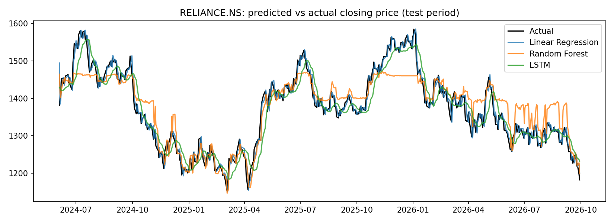

# Stock Price Trend Prediction: LSTM vs Random Forest vs Linear Regression

Predicts the next trading day's closing price of Reliance Industries (`RELIANCE.NS`) from the previous 30 days of prices, and compares three models against a simple baseline.

## Problem
Can machine learning predict short-term stock price movement better than a simple "tomorrow = today" baseline?

## Data
- Source: Yahoo Finance via the `yfinance` library
- Stock: Reliance Industries (`RELIANCE.NS`), 2015-01-01 to 2026-09-30 (adjusted close prices)
- Feature: closing price only (previous 30 days)

## Method
1. Built 30-day sliding windows; target = next day's close
2. Split chronologically: first 80% train, last 20% test (no shuffling, so the model never sees the future)
3. Fitted the MinMax scaler on training data only to avoid data leakage
4. Models: Naive baseline, Linear Regression, Random Forest (200 trees), LSTM (64 units, dropout 0.2, early stopping)
5. Metrics: RMSE, MAE (in rupees) and directional accuracy (up/down)

## Results

| Model | RMSE | MAE | Directional accuracy (%) |
|---|---|---|---|
| Naive (yesterday's close) | 18.30 | 13.42 | n/a |
| Linear Regression | 18.58 | 13.75 | 44.2 |
| Random Forest | 43.04 | 33.17 | 51.6 |
| LSTM | 34.80 | 27.21 | 51.8 |

## Key findings
- The naive baseline had the lowest error. Linear Regression came very close, and the chart suggests it mostly learned to repeat the previous day's price.
- Random Forest performed worst. Between about October 2025 and January 2026 its prediction stays flat while the real price keeps rising. Tree-based models cannot predict values outside the range seen in training, so they fail when prices reach new highs.
- The LSTM produced a smoother curve but lagged behind the real price at turning points.
- Directional accuracy for all models was between 44% and 52%, close to a coin flip, so none predicted up and down moves reliably.

## Limitations
- One stock, price-only features (no volume, technical indicators or news)
- Predicts the next day only, with a single train/test split
- Not financial advice; past performance does not predict future returns

## Next steps
- Predict returns (daily % change) instead of raw prices to avoid the range problem
- Add features such as volume, moving averages and RSI
- Test on more stocks and use walk-forward validation

## How to run
1. Open `stock_price_prediction.ipynb` in Google Colab
2. Click Runtime, then Run all
3. Results are saved as `results.csv` and `predictions.png`

## Tools
Python, Pandas, NumPy, Scikit-learn, TensorFlow/Keras, Matplotlib, yfinance
